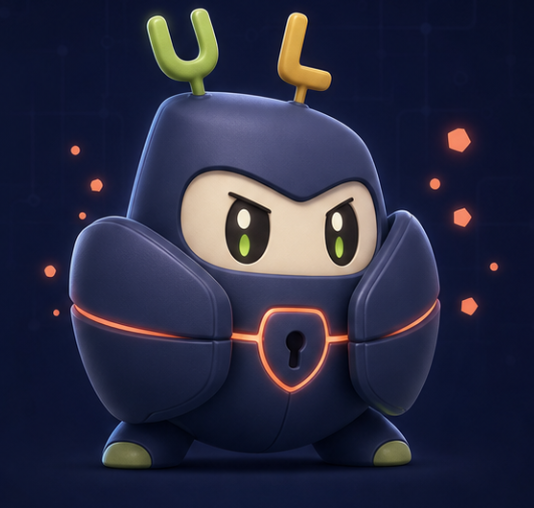

# Sistema de marca de UtilLock

## Idea central

UtilLock protege la atención sin regañar. La marca debe sentirse firme cuando
interrumpe una distracción y cálida durante el resto de la experiencia.

**Promesa:** tu atención queda bajo cuidado.

**Personalidad:** protectora, clara, serena, optimista y tecnológica.

## Uli, guardián del foco

Uli es un guardián compacto de armadura azul oscura, con cara crema, aura
naranja y un escudo-candado luminoso en el pecho. Las antenas en forma de
**U** (verde lima) y **L** (amarillo mostaza) son su firma visual y anclan el
nombre UtilLock en el personaje.

### Rasgos que siempre deben conservarse

- Cuerpo stout, redondeado y protector; nunca una esfera perfecta.
- Capucha/armadura azul navy con cara crema empotrada.
- Antenas literales: **U** a la izquierda y **L** a la derecha.
- Escudo naranja con silueta de cerradura (keyhole) en el pecho.
- Línea horizontal naranja que envuelve el torso.
- Aura de partículas naranjas (hexágonos / chispas suaves).
- Ojos oscuros grandes con destellos lima; expresión amistosa o determinada.
- Material suave tipo soft-3D, brillos controlados y bordes redondeados.

### Elementos que no pertenecen a Uli

- Cuerpo violeta/lavanda del concepto anterior.
- Arco de candado púrpura encima de la cabeza (reemplazado por antenas U/L).
- Núcleo circular aqua como único símbolo de pecho.
- Proporciones de bebé exageradas o expresiones agresivas.
- Globos de diálogo como parte permanente del personaje.
- Movimiento nervioso, temblores o celebraciones invasivas.

## Paleta

| Rol | Color |
| --- | --- |
| Fondo principal | Ink `#05060E` |
| Cuerpo de Uli / marca profunda | Navy `#1B2140` |
| Aura y candado | Orange `#FF7A2F` |
| Antena U / ojos | Lime `#A8C93A` |
| Antena L | Mustard `#E8B23A` |
| Cara | Cream `#F2E6C8` |
| Protección activa | Orange glow `#FF8A3D` |
| Bloqueo y alerta | Rose `#FF6B7A` |
| Pausa y Premium | Gold `#FFC857` |

El naranja confirma energía de protección; el rose marca una interrupción
firme; el gold se reserva para pausa y Premium. Ningún estado debe depender
solo del color.

## Estados

| Estado | Expresión y postura | Movimiento |
| --- | --- | --- |
| `Idle` | Mirada firme amable, brazos relajados, aura naranja | Respiración, flotación y parpadeo |
| `Protected` | Sonrisa leve, escudo activo | Burbuja naranja y pulso lento |
| `Blocking` | Cejas firmes, palma al frente | Entrada corta y partículas naranja |
| `Thinking` | Mano cerca del rostro | Balanceo suave |
| `Success` | Ojos felices, brazos arriba | Salto único y destellos breves |
| `Paused` | Ojos cerrados, cuerpo relajado | Descenso lento y aura tenue |

El loop base dura seis segundos. Las reacciones de bloqueo y éxito son cortas;
después permanecen en una pose tranquila. Si las animaciones del sistema están
desactivadas, se muestra una pose estática completa.

## Voz

Uli habla en frases breves, directas y en primera persona plural cuando
acompaña a la persona.

- Activo: “Tu foco está protegido.”
- Bloqueo: “Esto puede esperar.”
- Reto: “Piénsalo con calma.”
- Éxito: “Listo. Tú decides.”
- Pausa: “Tomemos un respiro.”

Evitar culpa, infantilización, signos de exclamación repetidos y lenguaje de
castigo.

## Uso en producto

- **Dashboard:** compañero de estado dentro de Bloqueo rápido.
- **Protección:** confirma visualmente que las capacidades están listas.
- **Pantalla bloqueada:** reemplaza el candado genérico con la pose `Blocking`.
- **Reto:** usa `Thinking` durante la evaluación y `Success` al aceptar.
- **Icono y splash:** emplean silueta navy, escudo naranja y antenas U/L.

El personaje debe apoyar la tarea principal, no competir con títulos, botones
ni información crítica.
